# WaveGuard — Système de Détection de Fraude Mobile Money en Temps Réel
**École Polytechnique de Thiès — DIC2 / GIT / Big Data 2025-2026**

## Aminata Fianyah & Ndeye Absa Nder 

---

## Table des matières
1. [Partie 0 — Environnement](#partie-0)
2. [Partie 1 — Ingestion Kafka](#partie-1)
3. [Partie 2 — Spark Structured Streaming](#partie-2)
4. [Partie 3 — Tolérance aux pannes](#partie-3)
5. [Partie 4 — Monitoring Grafana](#partie-4)
6. [Partie Optionnelle — Sécurité Kafka](#partie-optionnelle)

---

## PARTIE 0 — Mise en place de l'environnement <a name="partie-0"></a>

### 0.1 Objectif
Déployer un environnement Big Data complet avec Docker Compose comprenant : Zookeeper, Kafka, Spark (Master + Worker), Airflow et Grafana.

### 0.2 Modifications effectuées
Le fichier Docker Compose fourni présentait plusieurs problèmes (conteneurs instables, images `latest`, configuration Spark incomplète). Les corrections apportées :
- Remplacement des images `latest` par des versions stables (Kafka/Zookeeper 7.6.0, Spark 3.4.0)
- Séparation de Spark en Master et Worker
- Correction de la configuration Airflow

### 0.3 Vérification des services

```bash
docker compose up -d
docker compose ps
```

Services démarrés : Zookeeper, Kafka, Spark Master, Spark Worker, Grafana, Airflow.

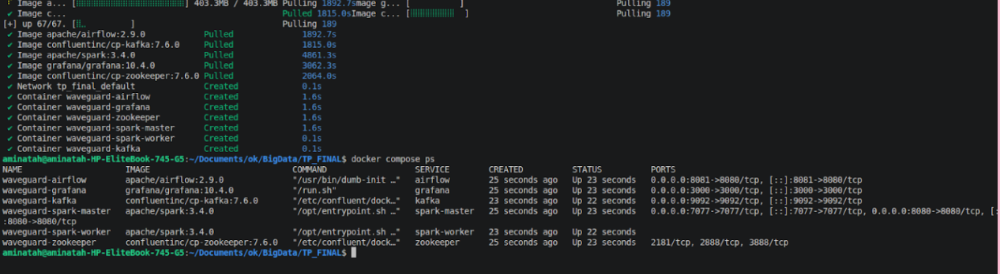

Interfaces accessibles :
- Spark Master : http://localhost:8080

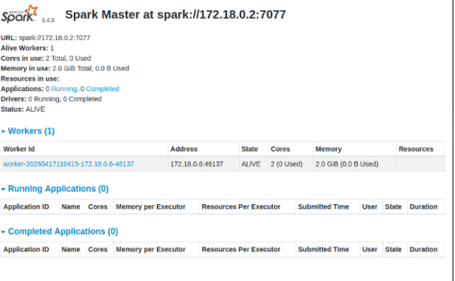

- Grafana : http://localhost:3000

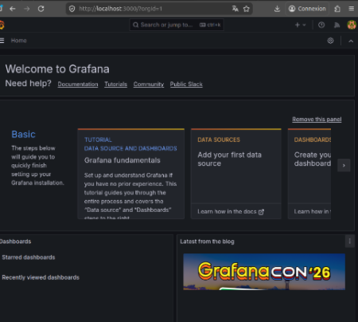

### 0.4 Installation des dépendances Python

Spark tournant dans Docker, seules les dépendances client sont nécessaires en local :

```bash
pip install confluent-kafka faker
```
---
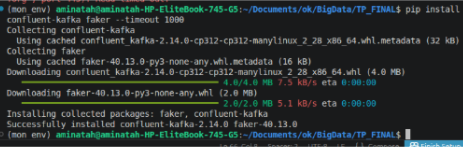

## PARTIE 1 — Ingestion Kafka <a name="partie-1"></a>

### 1.1 Création des topics

```bash
# Topic principal : flux de transactions
docker exec waveguard-kafka kafka-topics \
  --bootstrap-server localhost:9092 --create \
  --topic transactions --partitions 3 --replication-factor 1

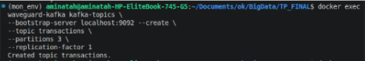

# Topic des alertes de fraude
docker exec waveguard-kafka kafka-topics \
  --bootstrap-server localhost:9092 --create \
  --topic fraud-alerts --partitions 1 --replication-factor 1

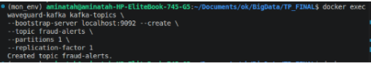

# Topic d'audit
docker exec waveguard-kafka kafka-topics \
  --bootstrap-server localhost:9092 --create \
  --topic audit-log --partitions 2 --replication-factor 1

  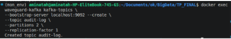

# Vérification
docker exec waveguard-kafka kafka-topics \
  --bootstrap-server localhost:9092 --describe --topic transactions
```
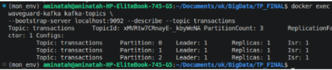

### 1.2 Producer Python

Le fichier `producer.py` simule des transactions Mobile Money avec :
- Injection de bursts frauduleux (8 transactions en rafale espacées de 50ms)
- Champ `is_flagged` positionné à `True` pour les comptes suspects
- Partitionnement explicite par `sender_id`

---

### Q1 — Justification du nombre de partitions

**3 partitions pour `transactions`** :
- Permet le parallélisme : plusieurs consommateurs Spark lisent en même temps
- Meilleure scalabilité pour un débit élevé (millions de transactions/jour)
- L'ordre est garanti par compte grâce à la clé `sender_id`

**1 partition pour `fraud-alerts`** :
- Garantit un ordre strict global des alertes
- Essentiel pour ne pas inverser ou mélanger les alertes de fraude

**Impact sur l'ordre** : Kafka garantit l'ordre uniquement à l'intérieur d'une partition. Avec 3 partitions, l'ordre est garanti par compte (même clé), mais pas globalement. Avec 1 partition, l'ordre est garanti sur toutes les alertes.

---

### Q2 — Ordre des messages et partitionnement

Kafka ne garantit **pas** l'ordre au niveau du topic entier. L'ordre est garanti uniquement à l'intérieur d'une partition.

Pour garantir que toutes les transactions d'un compte arrivent dans la même partition, on utilise `key=sender_id` dans `producer.produce()`. Cela force Kafka à router toutes les transactions du même compte vers la même partition.

---

### Q3 — Kafka vs RabbitMQ pour WaveGuard

| Critère     | Kafka                     | RabbitMQ    | 
|    ---      | ---                       | ---         |
| Débit       | Très élevé (millions/sec) | Modéré      |
| Streaming   | Natif                     | Limité      |
| Scalabilité | Horizontale               | Verticale   |
| Relecture   | Oui (log persistant)      | Non         |
| Complexité  | Plus élevée               | Plus simple |

**Choix : Kafka**, pour les raisons suivantes :
- Volume élevé de transactions (millions/jour)
- Besoin de streaming temps réel avec Spark
- Tolérance aux pannes avec replay possible
- Partitionnement natif adapté à la détection de fraude

---

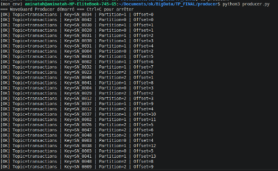
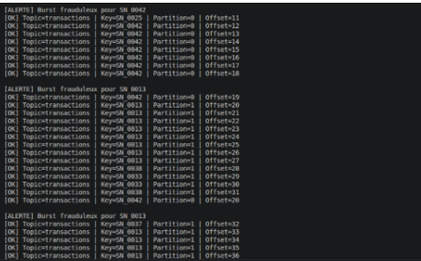
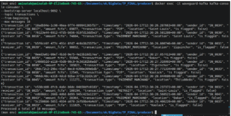

## PARTIE 2 — Spark Structured Streaming <a name="partie-2"></a>

### 2.1 Règle 1 — Fraude par vélocité

Détection de plus de 5 transactions depuis un même compte en 5 minutes (sliding window, slide 1 min).

### 2.2 Règle 2 — Fraude par volume

Détection d'un montant total supérieur à 500 000 FCFA depuis un compte sur 10 minutes (sliding window, slide 2 min).

### 2.3 Sinks multiples

- **Sink Kafka** (`fraud-alerts`) : alertes en temps réel avec `outputMode("update")`
- **Sink Parquet** (Data Lake) : archivage avec `outputMode("append")`

---

### Q4 — Tumbling Window vs Sliding Window

**Tumbling Window** : intervalles fixes non chevauchants. Chaque événement appartient à une seule fenêtre.
```
Fenêtre 5 min : [00:00–00:05] [00:05–00:10] [00:10–00:15] ...
```

**Sliding Window** : fenêtres qui se chevauchent, avançant par un pas plus petit que leur taille.
```
Fenêtre 5 min, slide 1 min : [00:00–00:05] [00:01–00:06] [00:02–00:07] ...
```

**Pourquoi sliding pour la fraude** : La fraude peut se produire entre deux fenêtres fixes et être ignorée. La sliding window capture les comportements continus et réduit les faux négatifs.

**Exemple concret (paramètres TP)** : SN_0042 envoie 6 transactions entre 12:00 et 12:03.
- Sliding window 12:00–12:05 → 6 transactions → **VELOCITY_FRAUD détecté** ✅
- Tumbling window : si 3 transactions avant 12:05 et 3 après → **fraude non détectée** ❌

---

### Q5 — outputMode append vs update

**`outputMode("update")` pour Kafka** : seules les lignes mises à jour depuis le dernier batch sont émises. Kafka attend des événements incrémentaux — renvoyer toutes les alertes à chaque batch provoquerait une duplication massive.

**`outputMode("append")` pour Parquet** : seules les nouvelles lignes finalisées (après le watermark) sont écrites. Compatible avec le format fichier qui ne supporte pas la mise à jour en place.

**Pourquoi `complete` serait problématique** :
- Réécrit toute la table à chaque micro-batch → coût explosif
- Non scalable avec des millions de transactions et des fenêtres glissantes
- Pour Kafka : renverrait toutes les alertes déjà envoyées → duplications massives

---
# SIMULATION DES FRAUDES 
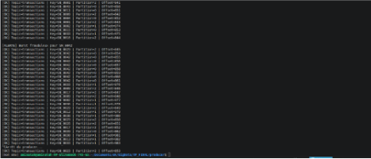
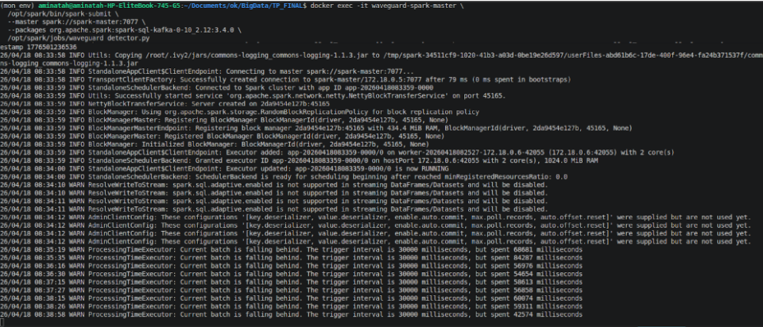
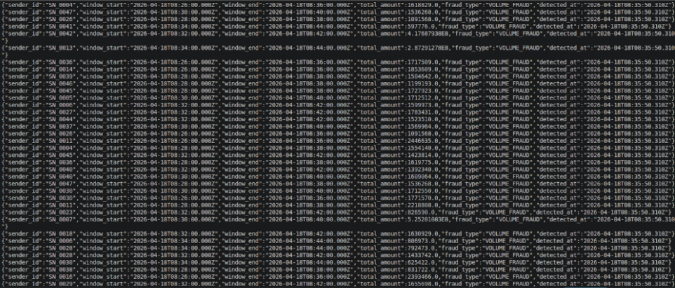


## PARTIE 3 — Tolérance aux pannes & Exactly-Once <a name="partie-3"></a>


### 3.1 Procédure de crash et reprise

```bash
# 1. Lancer producer et detector
python3 producer.py &
spark-submit waveguard_detector.py &

# 2. Vérifier les offsets
docker exec waveguard-kafka kafka-consumer-groups \
  --bootstrap-server localhost:9092 \
  --group spark-waveguard --describe

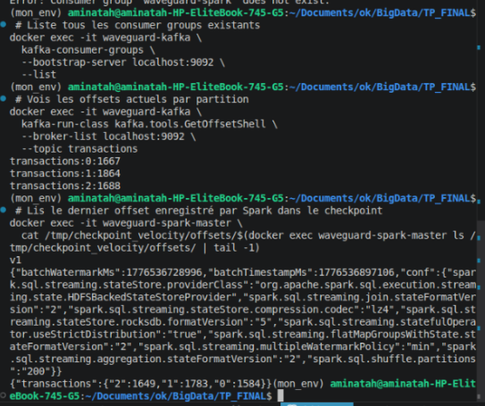
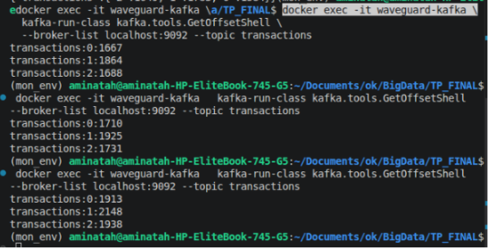

# 3. Simuler un crash
kill -9 <PID_SPARK>

# 4. Attendre 30 secondes (producer continue)
# 5. Relancer sans modifier le checkpoint
spark-submit waveguard_detector.py
```

### 3.2 Résultats observés

```
batch 0  → 18:24  ✅
batch 1  → 18:25  ✅
batch 6  → 18:28  ✅
         ← CRASH à ~18:39
batch 7  → 18:39  ✅  ← reprise immédiate !
batch 8  → 18:41  ✅
```
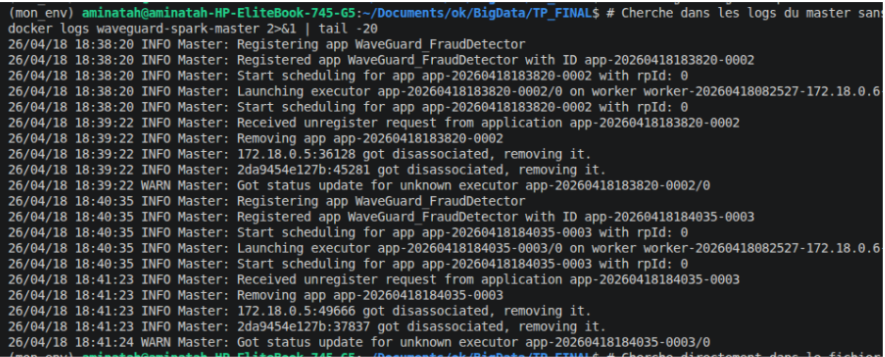
 

Gap de 11 minutes entre batch 6 et batch 7 = période de panne.
Spark a repris exactement au batch 7 sans sauter ni répéter aucun batch. ✅

Offsets avant crash :
- partition 0: 1584 | partition 1: 1783 | partition 2: 1649

Messages accumulés pendant la panne :
- transactions:0 → +329 messages | transactions:1 → +365 | transactions:2 → +289

Après redémarrage : Spark rattrape automatiquement le retard. ✅

---

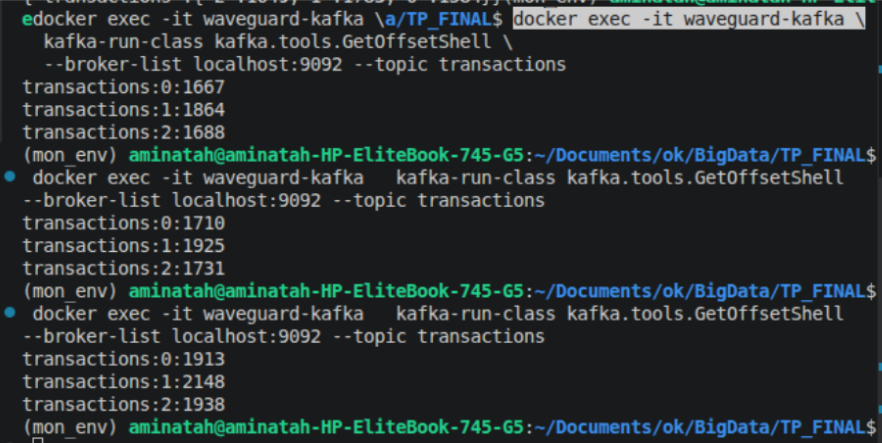 

### Q6 — Mécanisme de checkpoint Spark

Le checkpoint fonctionne en trois couches :

1. **`offsets/`** : enregistre avant chaque micro-batch les offsets Kafka à lire (journal d'intention)
2. **`commits/`** : confirme après chaque batch réussi que le traitement est terminé
3. **Au redémarrage** : Spark compare `offsets/` et `commits/`, reprend depuis le dernier offset non commité

Si `offsets/N` existe mais pas `commits/N` → batch N incomplet, Spark le rejoue.

**Si on supprime le checkpoint** : Spark repart depuis `startingOffsets: earliest`, retraitant tous les messages depuis le début → doublons massifs dans `fraud-alerts` et le datalake Parquet.

---

### Q7 — Conditions pour l'exactly-once end-to-end

**Niveau 1 — Source Kafka → Spark** : garanti par le checkpoint. Spark ne rejoue un offset que si le batch n'a pas été commité.

**Niveau 2 — Spark → Sink Kafka** : maillon faible. Le sink Kafka est `at-least-once` par défaut. Pour l'exactly-once, il faudrait un producteur Kafka idempotent (`enable.idempotence=true`) avec des transactions Kafka.

**Niveau 3 — Spark → Sink Parquet** : exactly-once si le système de fichiers supporte les opérations atomiques. En local, c'est garanti. Sur HDFS/S3, Spark utilise un renommage atomique.

---

## PARTIE 4 — Monitoring Grafana <a name="partie-4"></a>
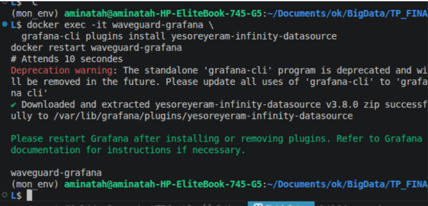 
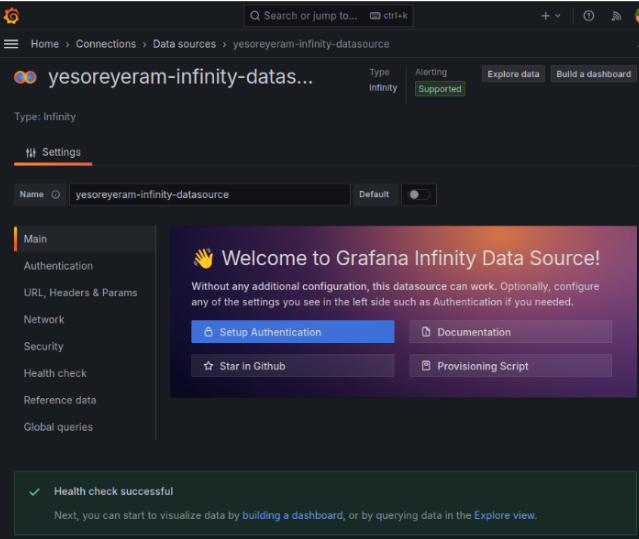 

### 4.1 Architecture de monitoring

```
Pipeline Python → metrics_exporter.py → /tmp/waveguard_metrics.json
                → metrics_prometheus.py (port 9998, format Prometheus)
                         ↓
                    Prometheus (port 9090)
                         ↓
                    Grafana (port 3000)
                         ↓
                Alertmanager → Slack #nouveau-canal
```

### 4.2 Lancement des services de monitoring

```bash
python3 spark/metrics_exporter.py &
python3 spark/metrics_prometheus.py &
sudo iptables -I INPUT -p tcp --dport 9998 -j ACCEPT
```

### 4.3 Dashboard WaveGuard

| Panel | Type | Query Prometheus | Seuil |
|---|---|---|---|
| Alertes Vélocité | Stat | `waveguard_velocity_alerts` | > 10 → rouge |
| Alertes Volume | Stat | `waveguard_volume_alerts` | > 5 → rouge |
| Top Fraudeur | Table | `waveguard_top_count` | — |
| Transactions/min | Time Series | `waveguard_volume_alerts` | — |
## Dashboard Grafana

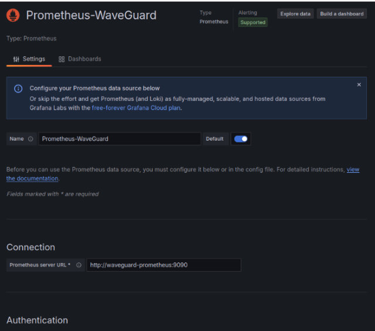
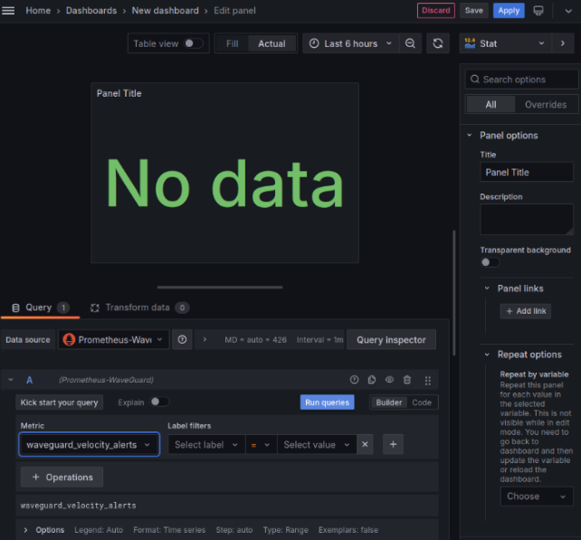

### 4.4 Alerte configurée

- **Règle** : `Fraude Vélocité Critique` — se déclenche si `waveguard_velocity_alerts > 10` pendant 5 minutes
- **Contact point** : Slack (`#nouveau-canal`) via Incoming Webhook
- **Résultat** : notification `[FIRING:1] Fraude Vélocité Critique WaveGuard` reçue dans Slack ✅

---
# Alerts Velocity 
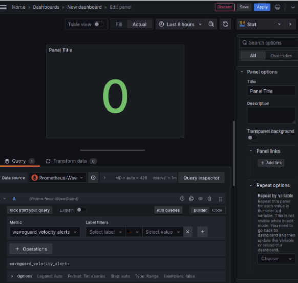
# Apres rafraichissement :
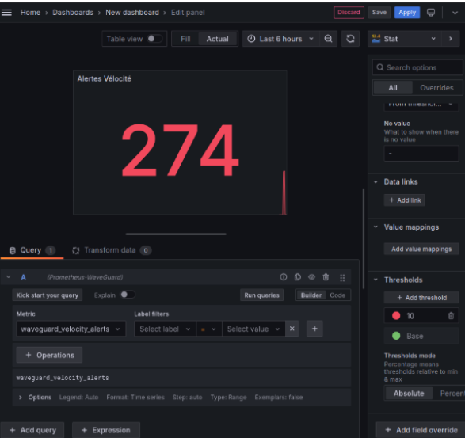
# Alerts Volume
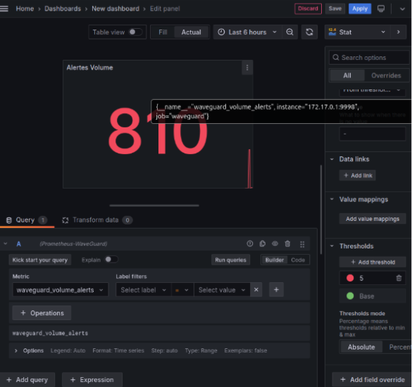
# Apres rafraichissement :
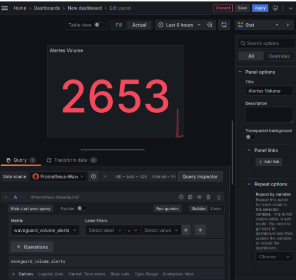

# Top Fraudeur: 
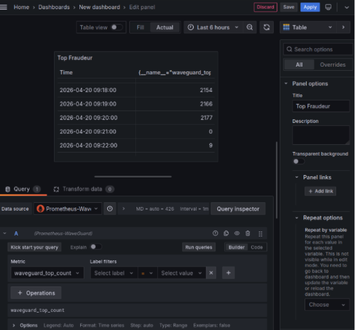

# Confuguration de l'alerte : 

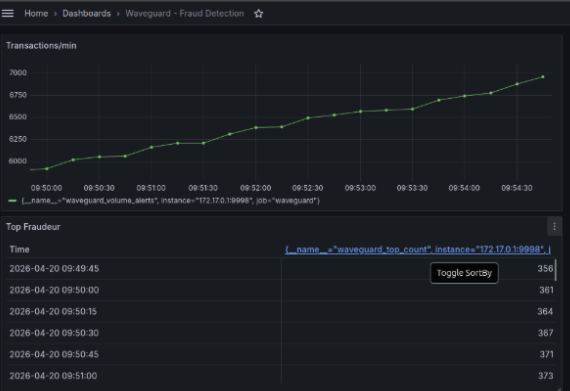

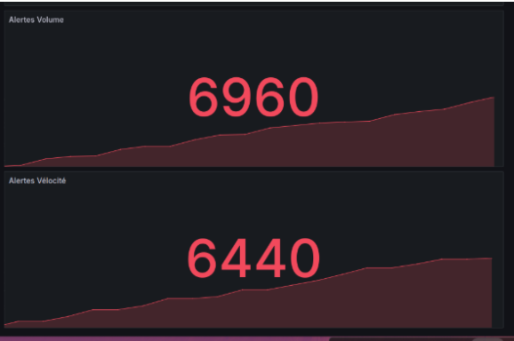
# Configuaration de l’alerte: 
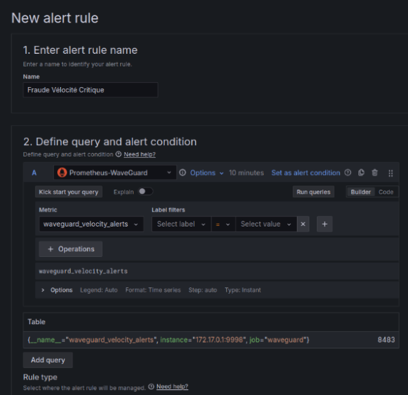

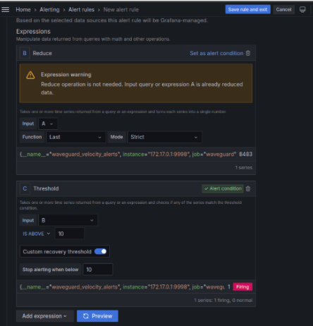

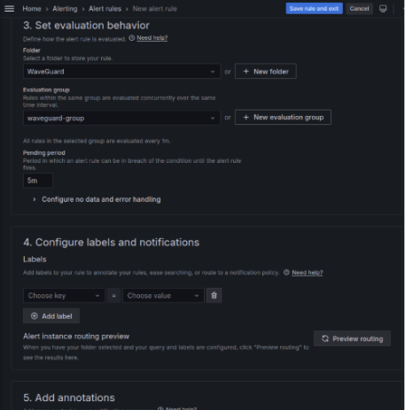

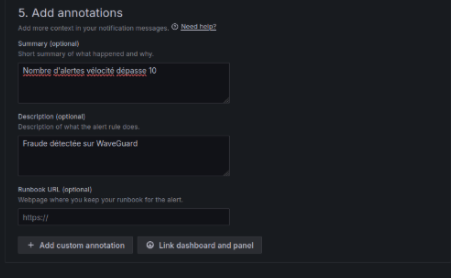
# CREER un workspac slack pour recevoir notifs 
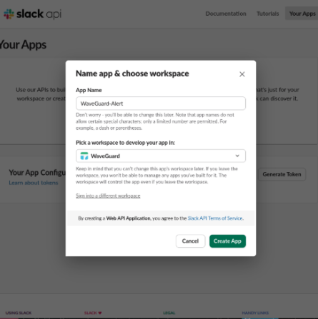
# Test de slack :
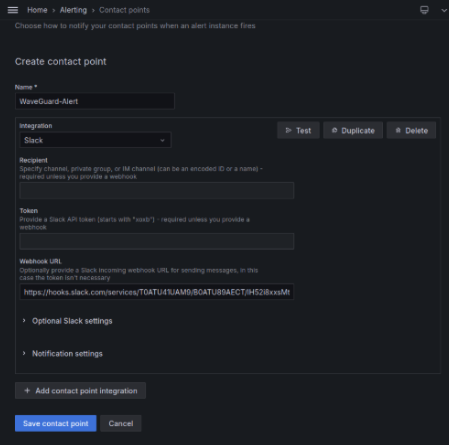

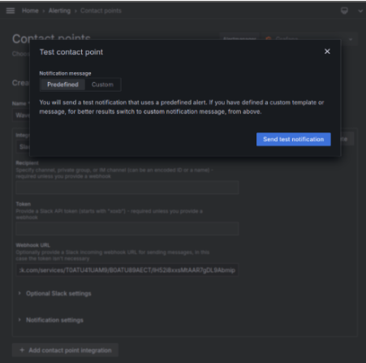
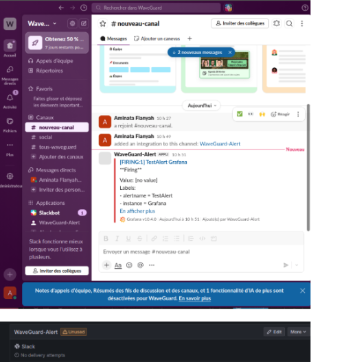

# Liaison du slack avec les notifications d’alertes : 
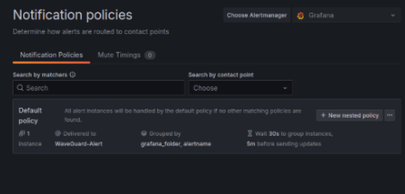
# le teste passe 
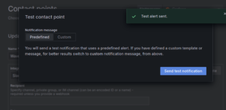

# Maintenant les notifications d’alertes se voient directement dans le canal: 

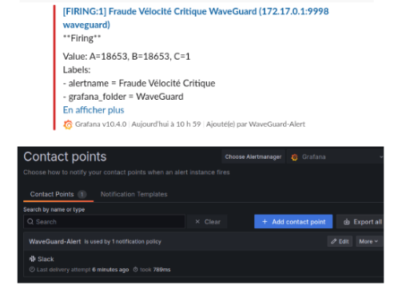


### Q8 — Architecture de monitoring en production

**Sources recommandées** :
- **Kafka** : JMX Exporter (consumer lag, throughput) + Kafka Exporter (consumer groups lag)
- **Spark** : Prometheus Servlet via `spark.metrics.conf` (jobs, stages, executors)

**Architecture complète** :
```
Kafka (JMX)  ──→ JMX Exporter (:7071)   ──→ Prometheus ──→ Grafana
Spark        ──→ Prometheus Servlet      ──→ Prometheus ──→ Grafana
Pipeline     ──→ Custom Exporter (:9998) ──→ Prometheus ──→ Grafana
                                                              ↓
                                                       Alertmanager
                                                      ↙            ↘
                                                  Email            Slack
```

---

## PARTIE OPTIONNELLE — Sécurisation du Pipeline Kafka <a name="partie-optionnelle"></a>

### Op.1 — Activation de SASL/PLAIN

Fichier `kafka_server_jaas.conf` :
```
KafkaServer {
    org.apache.kafka.common.security.plain.PlainLoginModule required
    username="admin"
    password="admin-secret"
    user_admin="admin-secret"
    user_spark="spark-secret"
    user_producer="producer-secret";
};
```
 # Création du fichier admin.properties 

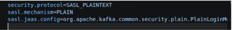


### Op.2 — Définition des ACLs

```bash
# Producer : écriture autorisée
kafka-acls --add --allow-principal User:producer --operation Write --topic transactions

# Spark : lecture autorisée
kafka-acls --add --allow-principal User:spark --operation Read --topic transactions --group spark-waveguard

# Producer : lecture REFUSÉE
kafka-acls --add --deny-principal User:producer --operation Read --topic transactions
```


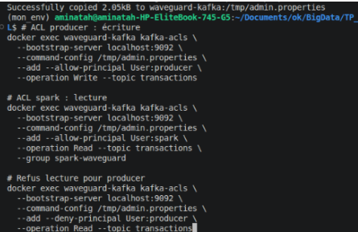

# La configuration passe :

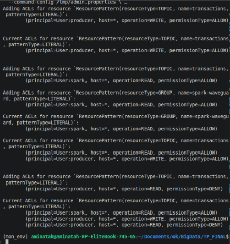


### Op.3 — Test de refus d'accès

```bash
docker exec waveguard-kafka kafka-console-consumer \
  --bootstrap-server localhost:9092 \
  --consumer.config /tmp/producer.properties \
  --topic transactions
```

**Résultat obtenu** :
```
GroupAuthorizationException: Not authorized to access group: console-consumer-68616
```
Le compte `producer` est bien refusé en lecture. ✅

---
 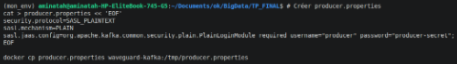
 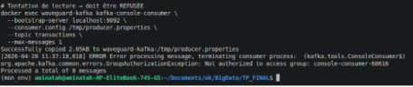


### Q9 — SASL/PLAIN vs SASL/SCRAM vs SASL/GSSAPI

| Mécanisme | Sécurité | Complexité | Cas d'usage |
|---|---|---|---|
| SASL/PLAIN | Faible (credentials en clair) | Très simple | Dev/Test uniquement |
| SASL/SCRAM | Moyenne (mots de passe hashés) | Modérée | Production sans Kerberos |
| SASL/GSSAPI (Kerberos) | Très élevée | Élevée | Enterprise avec Active Directory |

**Choix pour Mobile Money** :
- **Dev/Test** → SASL/PLAIN (ce TP)
- **Production petite équipe** → SASL/SCRAM
- **Production enterprise (Wave, Orange Money)** → SASL/GSSAPI avec Kerberos

